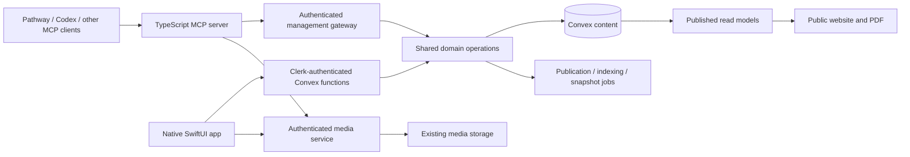

# MCP and native iOS administration migration

Prepared 15 September 2026. Planning only: no application, authentication or deployment changes are made by this document.

Source baseline: personal-site `686b025`; Pathway `1fb0118cd7`. Recheck both before implementation because the native shell and backend contracts may change independently.

## Implementation status — 17 September 2026

The first MCP implementation slice is local and tested against personal-site
`737affe`. This is progress within the MCP phase; the complete migration is not
finished. No backend deployment, live content mutation or native app change was
made for this slice.

- [Field-level parity inventory](admin-operation-parity.md) records current
  browser/native gaps and the checks required before removing `/admin`.
- Dedicated owner-bound management credentials, expiry, scopes, revocation,
  atomic audit entries and seven-day retry receipts are implemented.
- [Local stdio server](../../packages/mcp/README.md) exposes 20 explicit tools:
  15 reads and five post draft/publish operations. Bun and compiled Node entry
  points are covered by real MCP client tests.
- Published post edits use a separate private draft, with base and draft
  revisions required at publication. HTTP router tests exercise real Convex
  dispatch and verify inbox scope, attachment credential redaction and private
  draft visibility.
- Validation: 54 backend tests, 21 MCP tests and all seven workspace typechecks
  pass. Knowledge jobs were checked without an embedding API key; live search,
  cache propagation, deployed credentials and a Pathway connection remain
  acceptance checks for rollout.

The security-reviewed foundation was committed locally as `aa981e4`. The next
slice adds ten project/Labs draft operations, bringing the server to 30 tools.
It preserves collector statistics and curation, validates project media before
publication, and supports explicit clearing of optional case-study fields.
Project/Labs detail reads return both the base record and private draft. Shared
human operations retain their owner-only authorization.

Combined validation now passes 87 backend tests, 27 MCP tests, 30 web tests and
all seven workspace typechecks. The changed website files also pass lint. An
independent source review found no remaining must-fix issue in this slice.

The public Labs catalogue and featured plates now respect missing/unpublished
Pathway rows instead of recreating a hard-coded fallback. A read-only check
confirmed that the configured live backend already has a published Pathway row;
this change does not require inventing or seeding a replacement. Catalogue and
server-render regression tests cover its absence. Page cache refresh still
follows the existing ISR behavior.

Next: add Fun writes, profile/settings/experience and inbox changes; featuring
and reordering; migrate code-owned résumé projects; add media and operational
tools. Then run
the deployment/client acceptance exercise before starting the native shell and
remaining iOS parity work. Existing browser administration stays available.

## Outcome and agreed sequence

The public website becomes a publishing surface with no browser admin, sign-in screen or browser editing session. Corey manages the same Convex content through an MCP server and a native SwiftUI iOS app. Build and validate the MCP first, complete the native app second, and remove the browser admin last.

The native app will use the resizing navigation treatment from Pathway's native iOS app. This means the real expanding/collapsing glass surface, not just a system tab bar with scroll minimisation. No React Native, Expo shell or web-admin wrapper.

Authentication remains necessary for management. Removing website login does not mean making write APIs anonymous. Retain Clerk for the native administrator initially; do not combine this migration with replacing the identity provider.

## What exists today

These findings come from source inspection, not a device parity test:

| Area | Current implementation | Consequence |
| --- | --- | --- |
| Browser admin | `apps/web/src/app/admin`, `components/admin` | Content, projects, Labs, experience, résumé, settings, fun, inbox and ingest tokens need replacement coverage. |
| Native app | `apps/ios/Home`, SwiftUI, iOS 26 deployment target | Evolve the existing app rather than build a second app. |
| Native navigation | `Home/App/RootView.swift` | Five tabs: Content, Fun, Profile, Operations, Card; currently standard `TabView` with `.tabBarMinimizeBehavior(.onScrollDown)`. |
| Native backend | `Home/Backend/HomeAppModel.swift` | Already contains live subscriptions, CRUD, publishing, experience ordering, résumé sync, settings, inbox, tokens and uploads. Code presence does not establish full parity. |
| Human authorization | `packages/convex/convex/lib/auth.ts` | Clerk identity must match `ADMIN_CLERK_USER_ID`; preserve this boundary. |
| Machine authorization | `ingestTokens.ts`, `http.ts` | Hashed, revocable ingest tokens exist. Their scopes are ingestion scopes, not content administration permissions. |
| Concurrent editing | `lib/revision.ts` | Revision checks exist, but expectations can be omitted. Require them for new management updates. |
| Media | `/api/native/upload`, `/api/uploadthing` | Native upload currently depends on Next.js/Clerk middleware. Removing proxy and dependencies blindly would break the app. |
| Publishing | Content mutations plus knowledge/snapshot code | Reuse existing publication, knowledge indexing and aggregation behavior. Do not write directly to tables from MCP. |
| Résumé projects | `apps/web/src/lib/resumeProjects.ts` | Curated project content and SpiritDevs presentation are currently code-owned. Move these into editable data before declaring full coverage. |
| Operations | Git rebuild/preview and repository map functions include internal-only operations | Expose only narrow, authorized operations; do not create an arbitrary Convex function runner. |

## Target architecture



The app calls the backend directly; it does not run MCP or depend on an agent being online. MCP is a client adapter over the same business operations. Keep validation, publication checks, ordering and revision enforcement in Convex so both clients behave consistently.

### Transport decision

Start with a local stdio MCP process in `packages/mcp`, launched by Pathway or another desktop client. It talks to the remote Convex management gateway, so it does not require a development website or a running local database. Use the official TypeScript SDK and pin the version actually validated with the chosen clients.

This gives the first usable server without introducing another always-on host. Credentials come from the local client configuration or credential store, never source control or tool arguments. Provide a sample configuration containing placeholders only.

Keep tool registration independent of transport. Add hosted Streamable HTTP only when a required client cannot launch stdio or needs remote access. That release must include transport-level authentication, supported protocol negotiation, resource/audience validation and an actual client compatibility test. Do not label a static bearer endpoint OAuth-compatible. Hosted authorization pages may live with the identity provider; there will be no admin login on the public website.

### Authorization and bootstrap

1. Introduce dedicated management credentials with an owner, name, digest, scopes, expiry, issue time, last-use time and revocation time. Reuse reviewed hashing conventions, not the existing ingest token scope union.
2. Scope families: `content:read`, `content:write`, `content:publish`, `profile:read`, `profile:write`, `media:write`, `inbox:read`, `inbox:write`, `operations:run`. Separate credential administration from ordinary agent access.
3. Bind every machine credential to the one authorized administrator and an environment. A development client must not silently target production.
4. The first credential is issued through an authenticated owner-only bootstrap command or the existing admin while it remains available. The MCP-first phase cannot depend on an unbuilt iOS credential screen.
5. Add native issue/revoke controls later. Display a newly issued secret once; list metadata only afterward. Do not give an ordinary MCP token permission to mint a more privileged token.
6. Every request checks expiry, revocation, owner and operation scope. Validate authorization inside the transaction that performs the write, not just in a preliminary HTTP check.
7. Preserve current ingestion credentials and HealthKit/collector behavior. They do not gain administrative access.
8. Keep service/storage credentials server-side. Do not ship a Convex deploy key, Clerk secret or UploadThing secret in either client.

## Phase 0 — inventory and migration baseline

Deliver an operation-by-operation parity checklist before implementing the gateway.

- Trace every browser action to its backend function and every native control to the same contract. Record field-level omissions, not just matching screen names.
- Identify public readers and derived consumers: site pages, PDF, knowledge search/Ask, feeds, sitemap, snapshots, Git statistics and HealthKit summaries.
- Export a recoverable copy of editorial content, settings, ordering and current publication state. Record schema/deployment revisions; keep exports containing private data out of Git.
- Classify operations as reads, draft saves, live changes, publication, archive/delete, uploads or maintenance.
- Record existing hard-delete semantics. Default new agent workflows to archive/unpublish; adding recovery for destructive operations must be explicit rather than pretending existing deletes are reversible.
- Audit browser-only dependencies and all callers of both upload routes before marking packages for removal.

**Exit:** every browser workflow has a named future owner: MCP, native app or a documented maintenance command. No unknown admin capability remains.

## Phase 1 — shared backend management contracts

### Business operations

Extract reusable domain functions where required from existing authenticated handlers. Keep public Convex entry points checking the human identity, and machine entry points checking management credentials. Neither adapter should bypass the other operation's publication or validation rules.

Use a fixed operation allowlist in the HTTP gateway. Do not accept arbitrary table names, arbitrary function references, SQL, scripts or a generic `execute` operation. Return structured error codes for unauthenticated, forbidden, invalid input, not found, revision conflict, rate limit and service failure.

Mutation inputs include stable record IDs, `expectedRevision` for existing records and an idempotency key. Creates use an explicit create operation; updates must not create a replacement record when an ID is missing. Preserve omitted fields and distinguish omitted values from explicit clearing. Reordering must validate the affected set atomically.

Write a bounded mutation receipt and audit entry in the same transaction as the content change. A retry with the same owner/key/payload returns the original result; the same key with a different payload fails. Limit receipt retention. Audit actor, operation, entity, timestamp, old/new revision and changed field names; avoid copying inbox bodies or secrets into generic logs.

### Draft and publication semantics

New content starts unpublished. Publication and unpublication have separate operations. Inspect updates to already-published rows: saving a change to a published record may currently alter the live site immediately. Do not promise draft isolation until it exists.

For published posts/projects/Labs, add an editorial draft alongside the published version if the current model cannot stage revisions. Draft saves must not leak through public list/get, PDF, snapshots, feeds or knowledge search. Publish validates and applies the exact expected draft revision atomically. Settings and résumé changes may remain explicit live updates, but their tools and native buttons must say so.

### Code-owned content migration

Move selected résumé projects into a typed, optional Convex résumé field with stable IDs, name, description, URL and ordering. Seed the current public profile website, Pathway and Boca once, without overwriting later edits. Make the SpiritDevs role copy editable rather than replacing it by employer name during rendering. Update shared TypeScript types, Swift models, web rendering and PDF props. Older documents must still load during rollout.

Inventory other editorial constants in Labs/homepage curation. Move values users are meant to edit into content records or settings; leave layout/design rules in code. Preserve the currently approved homepage order and omissions.

**Exit:** authenticated human and machine contract tests prove equivalent domain behavior, public reads remain filtered, and old clients can survive the additive schema rollout.

## Phase 2 — usable MCP server first

### Package structure

```text
packages/mcp/
  src/server.ts              tool/resource registration
  src/stdio.ts               local transport entry point
  src/config.ts              environment and credential configuration
  src/backend.ts             typed management gateway client
  src/tools/                 content, profile, media, inbox, operations
  src/resources/             schema/help and bounded context resources
  tests/                    protocol and adapter tests
  README.md                 install, connect, scope, revoke, troubleshooting
```

Keep tool results compact: ID, revision, status, changed fields and relevant public URL. List tools are paginated and support filters. Fetch large post bodies only through detail reads. Mark read-only and destructive tools accurately; annotations assist clients but never replace backend authorization.

### Tool coverage

| Domain | Planned operations | Release requirement |
| --- | --- | --- |
| Projects | list/get/create draft/update draft/publish/unpublish/feature/reorder | Screenshots, media order, links, stack, case-study body and all existing fields preserved. |
| Labs | list/get/create draft/update draft/publish/unpublish/feature/reorder | Preserve curated ordering and repository metadata boundaries. |
| Posts | list/get/create draft/update draft/preview/publish/unpublish | Native-compatible Markdown source, metadata and media; no raw HTML bypass. |
| Fun | list/get/create/update/archive where supported | Every existing entry kind, dates and media covered. |
| Experience | list/get/create/update/reorder | Approximate career dates and role summaries preserved. |
| Résumé | get/update/sync experience/selected projects | Website and PDF read the same saved content. |
| Site settings | get/update/availability | Explicit live-change wording; preserve unrelated nested fields. |
| Media | upload/status/attach metadata | File validation, captions/alt text and durable asset references. |
| Inbox | list/get/set status | Separate scopes; never automatically send email replies. |
| Operations | status/request approved refresh/job status | Narrow asynchronous jobs, not arbitrary internal function execution. |
| Credentials | inspect own capabilities | Creation/revocation remains owner-only bootstrap/native functionality. |

Tool names should be explicit, such as `get_resume`, `update_resume`, `create_post_draft`, `publish_post` and `request_git_refresh`. Avoid a single enormous tool with unrelated actions. Final names and required fields are written into the contract checklist before implementation.

### Media workflow

First preserve the currently working native upload route during migration. Then move upload authorization and storage orchestration to a backend service independent of the public Next.js app. A Convex action/HTTP route is the first candidate; verify runtime SDK support and limits with a real upload before committing to it. Use a small dedicated service only if those limits require it.

Use short-lived upload tickets bound to actor, content type, maximum size and intended purpose. Do not pass large base64 images through an agent's conversational tool result. The local MCP can upload a user-selected local file as bytes, return the asset ID, and attach it through a separate content update. A hosted server must not claim it can access a client's local filesystem. Validate MIME type, byte signature, size and completion; failed/cancelled uploads must not publish content. Keep orphan cleanup bounded and separate from ordinary editing.

### MCP acceptance exercises

Run through an actual supported client, not only direct HTTP tests:

1. Connect, list capabilities, read a draft and public content with the appropriate scope.
2. Create a draft post with an image, preview it, publish it, and verify the public/knowledge result after the documented refresh window.
3. Update the résumé project list and verify page/PDF parity.
4. Reorder Labs without dropping a row or exposing a draft.
5. Save from two clients and get a useful conflict on the stale save.
6. Retry a timed-out create and prove no duplicate record appears.
7. Revoke a token, test wrong scope and expiry, and prove failed requests do not mutate content.
8. Request a refresh, get a job ID, and poll its final status rather than blocking a tool indefinitely.

**Exit:** Corey can perform the content workflows through MCP while the browser admin remains available for recovery. This milestone is delivered before the native app redesign begins.

## Phase 3 — complete the native SwiftUI app

Use `apps/ios` and the existing bundle/project unless a concrete incompatibility requires otherwise. Preserve Clerk session renewal, Convex subscriptions, HealthKit sync and business-card sharing. Keep `project.yml` as the XcodeGen source of truth; regenerate the checked-in project rather than hand-editing it.

### App areas

| Navigation area | Responsibilities |
| --- | --- |
| Content | Posts, projects, Labs, drafts, published content, media and ordering. |
| Fun | Quick entries, photo capture, edits and existing entry categories. |
| Profile | Identity, experience, résumé, selected personal projects and availability. |
| Operations | Inbox, sync status, approved refresh jobs, management/ingest credentials and diagnostics. |
| Card | Existing QR, contact sharing and vCard features. |

Retain these familiar areas initially. A separate trailing quick-action button can open contextual creation; do not import Pathway's agent-orchestrator feature just because its shell has that button.

### Pathway resizable tab bar

Source references in `/Users/coreybaines/GitHub/pathway/apps/pathway-ios/Pathway/shared/views/`:

- `CompactAppShell.swift`: shell, `CompactAppShellMetrics`, private `PathwayTabBar` and its resizing navigation surface.
- `CompactTabBarButtons.swift`: selection indicator, destination buttons and accessibility semantics.
- `MainTabView.swift`: compact versus wider-layout routing.
- Trace `CompactThreadChromeState` and navigation constants to separate presentation state from Pathway-specific thread behavior.

Port the small navigation component into `Home/Shared/Navigation` with Home-owned destination types. Record source revision and preserve applicable license notices. Do not add a dependency on the entire Pathway app or change the Pathway checkout.

Important behavior to retain:

1. A single stable glass surface interpolates from the full tab row to a circle. Do not swap structurally different views and expect matched geometry to conceal the jump.
2. Measure expanded width using `onGeometryChange`; clamp to available width. Pathway's starting metrics are 58-point height, 16-point horizontal padding, 12-point spacing, 520-point maximum width and 8-point bottom padding. Validate these on Home's screens rather than assuming they fit unchanged.
3. Preserve active selection, expanded destination menu, matched selection background and explicit expand action.
4. Use Home navigation state for editor/detail collapse behavior. Do not carry over thread/composer conditions or issue-specific hiding rules.
5. Reserve bottom content space and handle the keyboard so the bar never covers the last field, Save or Publish.
6. Keep each tab's navigation path and unsaved draft state. Pathway's `.id(activeDestination)` reset must not discard an in-progress résumé or post when switching tabs.
7. Hidden controls cannot receive touches or VoiceOver focus. Preserve selected traits, labels, escape dismissal and Reduce Motion behavior.
8. Validate Dynamic Type, contrast/Reduce Transparency, portrait/landscape, small iPhones and iPad split view. Use an adaptive sidebar on wider layouts; do not stretch a phone pill indefinitely.

### Editor and data behavior

- Use native SwiftUI forms, pickers, sheets and navigation. Markdown editing can use a native text editor and native preview; do not embed the removed web editor.
- Compare every browser field with the native draft model, particularly media arrays, post metadata, project body, featured flags and ordering.
- Separate local draft state from subscribed server records. Subscription updates must not silently replace unsaved typing.
- Add discard protection and local recovery for long edits. Initial offline support means draft recovery and clear connectivity state, not automatic queued publishing.
- On conflict, preserve local content, fetch the latest revision and offer a review/reapply flow. Never blindly retry against the new revision.
- Show saving, saved, failed and publication state explicitly. Saving to Convex does not mean every ISR page has already refreshed.
- Add selected résumé project editing and PDF preview/share; verify the downloadable PDF matches current published data.
- Add owner-only management-token issuance/revocation with one-time reveal and copy controls. Keep tokens in Keychain, separate from HealthKit ingestion tokens.
- Keep private inbox data out of shared telemetry and notification previews by default.

**Exit:** simulator tests and a physical-device walkthrough cover every parity checklist row, including uploads over cellular, authentication renewal, app background/foreground, HealthKit and QR sharing.

## Phase 4 — remove the browser admin

Only start when MCP and native release gates pass and owner recovery is documented.

1. Deploy additive backend changes first; ship compatible MCP and TestFlight app versions. Use the new clients for an agreed observation period.
2. Verify native uploads no longer depend on the website route if the goal is to remove all management endpoints from the web app.
3. Delete `apps/web/src/app/admin`, browser-only `components/admin`, the admin auth provider, sign-in server actions, admin styles and related navigation links.
4. Remove `/api/uploadthing` only after verifying all callers/callbacks are migrated. Remove `/api/native/upload` only after the native build using the new service is available and any supported older build is handled explicitly.
5. Remove Clerk's Next.js dependency/proxy wiring when no retained web API needs it. Keep Clerk iOS and Convex authorization. Audit Tiptap and upload packages by imports; remove only browser-editor dependencies that are actually unused.
6. `/admin`, `/admin/sign-in` and former nested routes return 404, with no sign-in redirects. Remove middleware rewrite/redirect remnants and stale docs. Keep sensible crawler exclusions for private API paths.
7. Preserve public contact submission, contact attachment flows, `/api/ask`, PDF, images, feeds, telemetry ingestion and public bot/rate-limit protections. This is removal of browser administration, not removal of all public server functionality.
8. Update operational docs, environment examples, tests and ownership guidance. Remove web-only secrets after dependency verification, not globally from Clerk/Convex.
9. Confirm public pages load without browser auth configuration and drafts/private inbox content remain inaccessible anonymously.

**Exit:** no browser-admin route or bundle remains, and every everyday workflow succeeds through MCP or the native app.

## Verification and release strategy

| Layer | Required evidence |
| --- | --- |
| Backend | Auth/scope/expiry/revocation tests; stale revision and idempotency tests; publication isolation; reordering; old-document compatibility. |
| MCP | Protocol startup/tool listing, schema validation, structured errors, real client workflow, clean stderr/stdout separation, cancellation and retry behavior. |
| Media | Real upload on target runtime; invalid file and interruption cases; unauthorized requests; stable asset URLs. |
| Swift | Model contract tests, editor conflict handling, navigation state tests, Xcode build and simulator UI flows. |
| Devices | Small iPhone, large text, keyboard, rotation, reduced motion, iPad split view, physical-device photo upload and HealthKit. |
| Public website | Draft exclusion, résumé/PDF agreement, selected projects, contact/Ask/feeds unaffected, old admin routes return 404. |
| Operations | Credential rotation/revocation, backup restore exercise, refresh-job status and documented recovery without web admin. |

Run tests appropriate to each slice; don't defer all integration work to the final removal. A public-site rollback must not revoke working native credentials or require deleting new data. Keep schema changes additive until old clients are retired. Roll back presentation/API routing independently where possible; do not restore an old content snapshot over newer edits.

## Suggested implementation slices

1. Inventory, parity checklist and domain contracts.
2. Management credentials, scope enforcement and owner bootstrap.
3. Shared operations, revision requirements, idempotency and audit receipts.
4. First working stdio MCP: reads plus one end-to-end draft/publish workflow.
5. Remaining MCP content/profile/inbox tools, résumé data migration and media support.
6. MCP operational jobs, client setup and acceptance exercise.
7. Native shell port with Pathway resizing behavior and navigation-state tests.
8. Native editor parity, draft/conflict recovery and management-token controls.
9. Physical-device acceptance and independent upload backend cutover.
10. Browser admin removal, dependency cleanup and final public-site verification.

Each slice should have a reviewable change and a concrete acceptance result. Slices 1–6 form the MCP-first milestone. Slices 7–9 complete the native app. Slice 10 is the actual admin deletion.

## Explicit exclusions and decisions to confirm during implementation

- No React Native or webview admin; no multi-user roles, billing or organisation model.
- No general-purpose agent execution service or arbitrary database console.
- No identity-provider replacement unless existing Clerk cannot meet a verified requirement.
- Local stdio first; hosted MCP deployment is a separate choice driven by required clients.
- Native iOS 26 baseline follows the current project. Confirm distribution through the existing TestFlight setup before changing bundle IDs or signing.
- Confirm whether new content drafts must also isolate edits to already-published entries; the plan recommends yes and treats that as backend work.
- Confirm the permitted maintenance jobs and archival/recovery policy before exposing destructive tools.
- Rich project/post preview should be native-readable; pixel-identical website preview is not required for the first release.
- No application code or live profile changes are authorized merely by this planning document.

## External references

- [MCP TypeScript server documentation](https://ts.sdk.modelcontextprotocol.io/server): SDK transport support; recheck the installed version when implementation begins.
- [MCP authorization specification](https://modelcontextprotocol.io/specification/2025-06-18/basic/authorization): distinction between stdio credentials and HTTP authorization, including audience validation and token passthrough restrictions. Check the negotiated/current specification before implementing hosted support.
- [Apple GlassEffectContainer](https://developer.apple.com/documentation/swiftui/glasseffectcontainer) and [matched geometry glass transitions](https://developer.apple.com/documentation/swiftui/glasseffecttransition/matchedgeometry): native APIs used by the Pathway shell.
